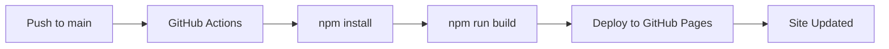

# Guide pour Mettre à Jour les Images du Site / Guide to Update Site Images

## 🇫🇷 Version Française

### Problème: L'image de profil ne se met pas à jour

Si vous remplacez une image (comme `Me3.jpeg`) mais qu'elle ne s'affiche pas sur le site déployé, suivez ces étapes:

#### ✅ Solution en 4 Étapes

**1. Remplacer l'image**
```bash
# Remplacez le fichier dans src/assets/
# Note: Assurez-vous que le nom et l'extension correspondent exactement au fichier d'origine
cp /chemin/vers/nouvelle/Me3.jpeg src/assets/Me3.jpeg
```

**2. Vérifier que le build fonctionne**
```bash
npm install
npm run build
```
- ✓ La commande doit se terminer sans erreur
- ✓ Vous verrez `dist/assets/Me3-XXXXXXXX.jpeg` avec un nouveau hash

**3. Committer et pousser vers `main`**
```bash
git add src/assets/Me3.jpeg
git commit -m "Mise à jour de l'image de profil"
git push origin main
```
⚠️ **IMPORTANT**: Le déploiement ne se déclenche QUE sur la branche `main`

**4. Attendre le déploiement et vider le cache**
- Attendez 2-3 minutes que GitHub Pages se mette à jour
- Videz le cache du navigateur: `Ctrl+F5` (Windows/Linux) ou `Cmd+Shift+R` (Mac)

#### 🔍 Comment Vérifier que ça Marche

**Vérifier le workflow GitHub Actions:**
1. Allez sur: https://github.com/Obelisk999/abdoulrazakportfolio/actions
2. Vérifiez que le workflow "Deploy to GitHub Pages" est vert ✓
3. Si rouge ✗, cliquez dessus pour voir l'erreur

**Vérifier l'image dans le build:**
```bash
npm run build
ls -lh dist/assets/Me3*.jpeg
```
- Le hash dans le nom de fichier (`Me3-XXXXXXXX.jpeg`) doit changer quand l'image change
- Si le hash est différent = l'image sera mise à jour ✓

#### 🐛 Dépannage

| Problème | Solution |
|----------|----------|
| L'image ne change pas après le déploiement | Videz le cache: `Ctrl+F5` / `Cmd+Shift+R` |
| Le workflow ne se déclenche pas | Vérifiez que vous êtes sur la branche `main` |
| Erreur de build | Vérifiez que l'image est un JPEG valide |
| L'image est trop grande | Optimisez l'image (< 500KB recommandé) |

---

## 🇬🇧 English Version

### Problem: Profile image is not updating

If you replace an image (like `Me3.jpeg`) but it doesn't show on the deployed site, follow these steps:

#### ✅ Solution in 4 Steps

**1. Replace the image**
```bash
# Replace the file in src/assets/
# Note: Ensure the name and extension match exactly the original file
cp /path/to/new/Me3.jpeg src/assets/Me3.jpeg
```

**2. Verify the build works**
```bash
npm install
npm run build
```
- ✓ Command should complete without errors
- ✓ You'll see `dist/assets/Me3-XXXXXXXX.jpeg` with a new hash

**3. Commit and push to `main`**
```bash
git add src/assets/Me3.jpeg
git commit -m "Update profile image"
git push origin main
```
⚠️ **IMPORTANT**: Deployment ONLY triggers on the `main` branch

**4. Wait for deployment and clear cache**
- Wait 2-3 minutes for GitHub Pages to update
- Clear browser cache: `Ctrl+F5` (Windows/Linux) or `Cmd+Shift+R` (Mac)

#### 🔍 How to Verify It Works

**Check GitHub Actions workflow:**
1. Go to: https://github.com/Obelisk999/abdoulrazakportfolio/actions
2. Verify the "Deploy to GitHub Pages" workflow is green ✓
3. If red ✗, click on it to see the error

**Check the image in the build:**
```bash
npm run build
ls -lh dist/assets/Me3*.jpeg
```
- The hash in filename (`Me3-XXXXXXXX.jpeg`) should change when image changes
- If hash is different = image will be updated ✓

#### 🐛 Troubleshooting

| Problem | Solution |
|---------|----------|
| Image doesn't change after deployment | Clear cache: `Ctrl+F5` / `Cmd+Shift+R` |
| Workflow doesn't trigger | Verify you're on `main` branch |
| Build error | Check that image is a valid JPEG |
| Image is too large | Optimize image (< 500KB recommended) |

---

## 🔧 Technical Details

### How Vite Handles Image Caching

The project uses **Vite**, which automatically adds content-based hashing to assets:
- Original: `Me3.jpeg`
- Built: `Me3-BTM0KDvZ.jpeg`

**When you change the image:**
- The content hash changes: `Me3-BTM0KDvZ.jpeg` → `Me3-NewHash.jpeg`
- Browsers automatically download the new image (cache bypass)
- No manual cache busting needed! ✓

### Deployment Process



### Important Files

- **Image**: `src/assets/Me3.jpeg`
- **Component**: `src/components/HeroSection.tsx` (line 4)
- **Build Config**: `vite.config.ts`
- **Deployment**: `.github/workflows/deploy.yml`
